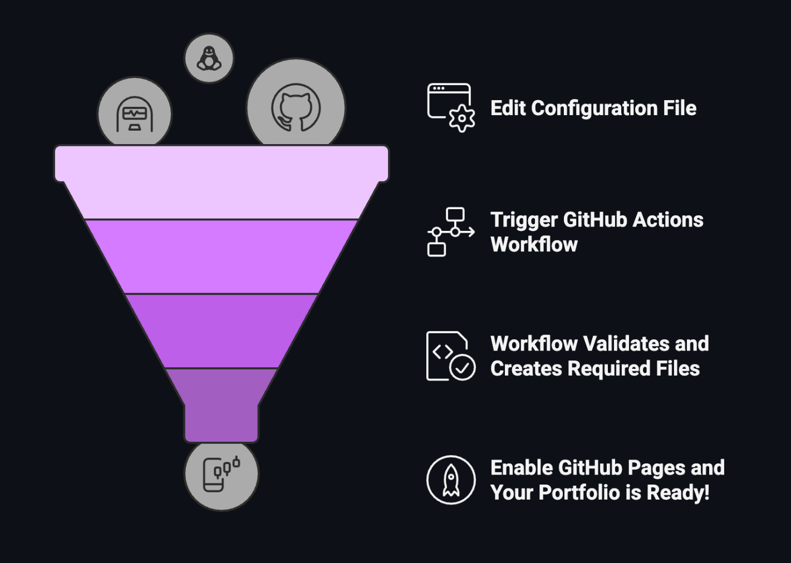

# Developer Portfolio Template

A modern, fully configurable developer portfolio that adapts to your content. Built with vanilla JavaScript and designed for GitHub Pages with automatic setup, dynamic content loading, and intelligent README generation.

<div align="left">

[](https://github.com/yashrajnayak/developer-portfolio/generate)

</div>

[](https://yashrajnayak.github.io/)

## 🚀 Quick Start

1. Click "Use this template → "Create a new repository"
2. Name your repository `yourusername.github.io` (replace `yourusername` with your actual GitHub username)
3. Wait for automatic setup - The template will automatically:
   - Create personalized `config.json` with your GitHub username
   - Generate initial README.md with your GitHub stats
   - Update LICENSE file with your name
   - Remove template-specific files
   - Prepare everything for customization
4. Customize your portfolio by editing `config.json` with your details
5. After editing `config.json` go to Actions → "Update README from Config" → click on "Run workflow" and again "Run workflow"
6. Check if GitHub Pages is enabled: Go to Settings → Pages → Deploy from branch → main

Wait for GitHub Pages deployment to complete and your portfolio would be live! 🎉

## ✨ Technical Features

- 🤖 Automatically initializes your portfolio when you use the template
- ⚙️ Zero code changes required - everything configured through JSON
- 🎛️ Feature Flags to enable/disable sections (about, projects, experience, skills, GitHub projects)
- 🚀 GitHub integration which automatically displays repositories with "featured" topic
- ⚡ Performance optimized - fast loading with lazy images and efficient DOM updates
- 🏗️ Modular Architecture with clean, maintainable codebase

## 🎨 User Experience

- 📱 Fully responsive mobile-first design
- 🌓 Dark/light mode - smooth transitions with persistent preferences
- 📊 Add 1 project or 100 projects - website adapts automatically
- 🔗 Project links - Add links to live demos, repositories, or project pages for each project

### ⚡ Automatic Setup

When you create a repository from this template:

- GitHub Actions automatically detects the new repository
- Checks if you named it correctly (`username.github.io`)
- Creates personalized `config.json` with your GitHub username pre-filled
- Generates a beautiful README.md with your GitHub stats
- Updates the LICENSE file with your name
- Removes all template-specific files you don't need
- Everything prepared for immediate GitHub Pages deployment ✅ 



## 📁 Project Structure

```
├── index.html              # Main HTML file
├── config.json             # Your portfolio configuration
├── .github/workflows/      # GitHub Actions for automation
│   ├── template-setup.yml  # Initial portfolio setup (run once)
│   ├── template-setup.js   # Setup script for template initialization
│   ├── update-readme.yml   # README updates from config
│   └── update-readme.js    # README updates script
├── css/                    # Modular CSS files
│   ├── main.css           # Main stylesheet that imports all modules
│   ├── base.css           # CSS reset, variables, base styles
│   ├── components.css     # Shared component styles
│   ├── theme.css          # Theme switcher and dark mode
│   ├── header.css         # Header and social links
│   ├── about.css          # About section styles
│   ├── skills.css         # Skills section styles
│   ├── experience.css     # Experience section styles
│   ├── projects.css       # Projects and GitHub projects
│   ├── animations.css     # Keyframe animations
│   └── responsive.css     # Mobile and tablet responsive styles
├── js/                     # Modular JavaScript files
│   ├── main.js            # Main application entry point
│   ├── config-manager.js  # Configuration loading
│   ├── seo-manager.js     # SEO meta tags management
│   ├── theme-manager.js   # Dark/light theme switching
│   ├── loading-manager.js # Loading screen management
│   ├── section-manager.js # Content sections rendering
│   ├── header-manager.js  # Header and social links
│   └── github-projects-manager.js # GitHub API integration
└── assets/
    ├── logos/              # Company logos (light and dark variants)
    └── projects/           # Project screenshots
```

## 🔧 Configuration

All portfolio content is managed through `config.json`. After the automated setup:

1. Update personal information in the `header` and `about` sections
2. Add your experience in the `experience.jobs` array
3. Showcase your projects in the `projects.items` array
4. List your skills in the `skills.categories` array
5. Configure social links in the `social_links` array

### Example config.json structure:
```json
{
  "header": {
    "greeting": "Your Name",
    "tagline": "Your Professional Tagline"
  },
  "about": {
    "paragraphs": [
      "Your introduction paragraph",
      "Additional details about your background"
    ]
  },
  "experience": {
    "jobs": [
      {
        "company": "Company Name",
        "role": "Your Role",
        "date": "Start - End",
        "responsibilities": ["Achievement 1", "Achievement 2"]
      }
    ]
  }
  // ... more configuration options
}
```

## 🎨 Customization

### Adding Company Logos
1. Add logos to `assets/logos/` folder
2. Use format: `Company_Logo.png` and `Company_Logo_White.png` (for dark mode)
3. Reference in config.json: `"logo": "assets/logos/Company_Logo.png"`

### Featured GitHub Projects
1. Add "featured" topic to repositories you want to showcase
2. They'll automatically appear in your "Projects on GitHub" section
3. No configuration needed - completely automated!

### Theme Customization
- Modify CSS custom properties in `css/base.css`
- Colors, fonts, and spacing all centrally managed
- Dark/light mode variants automatically handled

## 🚀 Deployment

### GitHub Pages (Recommended)
1. Your repository should be named `username.github.io`
2. Go to Settings → Pages
3. Source: "Deploy from a branch"
4. Branch: "main"
5. Your portfolio will be live at `https://username.github.io`

### Alternative Deployment
- **Netlify**: Connect your GitHub repository
- **Vercel**: Import your GitHub repository
- **Custom hosting**: Upload files to any web server

## 🔄 Automated Workflows

This template includes two powerful GitHub Actions:

### 1. Template Setup (`template-setup.yml`)
- **Triggers**: Automatically when repository is created from template
- **Function**: Initializes your portfolio from the template
- **Actions**: 
  - Validates repository name format (`username.github.io` recommended)
  - Creates personalized config.json with your GitHub username
  - Generates initial README.md with GitHub stats
  - Updates LICENSE file with your name and current year
  - Removes template-specific files (docs/, setup files, etc.)
  - Commits everything ready for deployment

### 2. README Manual Update (`update-readme.yml`)
- **Triggers**: Manual workflow dispatch only
- **Function**: Regenerates README.md from your latest config when manually triggered
- **Actions**:
  - Validates config.json format
  - Generates beautiful README with your GitHub stats and info
  - Commits updated README automatically

## 💡 Best Practices

1. **Repository Naming**: Use `username.github.io` for your main portfolio
2. **Featured Projects**: Add "featured" topic to 3-5 of your best repositories
3. **Regular Updates**: Keep your `config.json` updated with latest experience
4. **Logo Quality**: Use high-resolution logos for professional appearance
5. **Content Length**: Keep descriptions concise but informative

## 🤝 Contributing

Want to improve this template?

1. Fork the repository
2. Create your feature branch (`git checkout -b feature/amazing-feature`)
3. Commit your changes (`git commit -m 'Add amazing feature'`)
4. Push to the branch (`git push origin feature/amazing-feature`)
5. Open a Pull Request

## 📄 License

This project is open source and available under the [MIT License](LICENSE).

Built with ❤️ for the developer community
